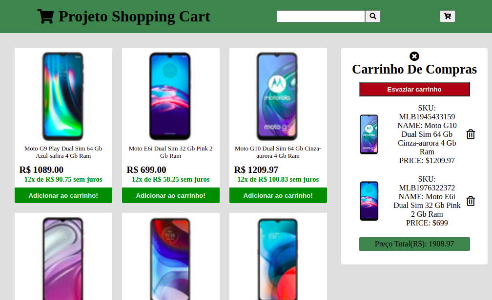

<h1 align="center">
  Projeto Shopping Cart
</h1>

  <a href="#-tecnologias">Tecnologias</a>&nbsp;&nbsp;&nbsp;|&nbsp;&nbsp;&nbsp;
  <a href="#-projeto">Projeto</a>&nbsp;&nbsp;&nbsp;|&nbsp;&nbsp;&nbsp;
  <a href="#-layout">Layout</a>

 

 

  

## 🚀 Tecnologias

Esse projeto foi desenvolvido com as seguintes tecnologias:

- HTML
- CSS
- JavaScript

## 💻 Projeto

O projeto Shopping Cart tem como finalidade realizar o Front-End de uma aplicação responsiva de um carrinho de compras para um e-commerce, utilizando-se de requisições a API do Mercado Livre.

## 🔖 Deploy

Você pode visualizar a aplicação do projeto através [desse link](https://isaaccruzlm.github.io/ShoppingCart/).

---

By Isaac Cruz Leite Machado :wave:.
